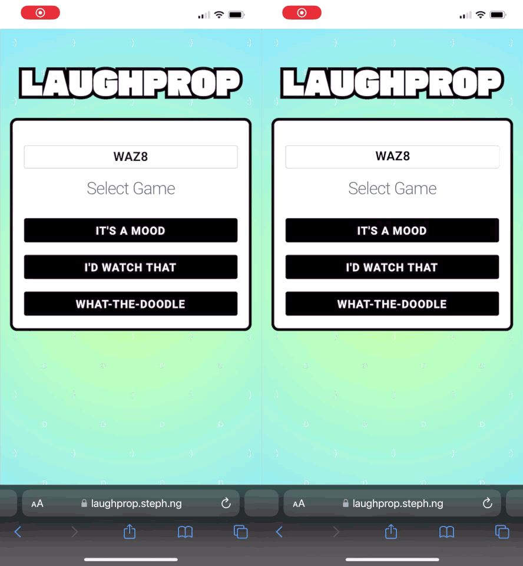
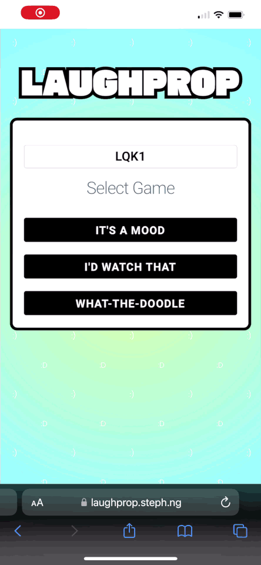

# Laughprop: Stable Diffusion Party Game
*Copyright 2023 Bart Trzynadlowski and Steph Ng*

<p align="center">
  
</p>

<p align="center">
  
</p>

## Overview

Laughprop is a basic Stable Diffusion based party game developed originally as a demo for the [CVPR2023 demo and art exhibition](https://cvpr2023.thecvf.com/Conferences/2023/CallForDemos).

Laughprop contains three mini-games:

1. **It's a Mood**: Given a theme, write a prompt to generate an image. Players vote for the best one.
2. **I'd Watch That**: Players select from a list of movies and play the role of casting director by replacing the original actors with their picks. The best voted movie wins.
3. **What-the-Doodle**: Players describe a scene that they feel they could draw. These are revealed to other players who must draw them using simple line doodles. An image is generated from the doodle and then passed along for captioning. The results are then shown: initial description, image generated from doodle, caption (interpretation). Recommended for 3+ players.

I'm not an experienced web developer so I went with jQuery for the frontend and wrote the backend using Node.js with minimal external dependencies. The server and frontend communicate using a WebSocket connection, which seems to work quite well. An attempt has been made to make the protocol resilient to disconnects (e.g., if the phone screen turns off). This isn't bullet-proof and the entire protocol should be changed to be less stateful.

## Setup and Deployment

### Node.js

Node.js is required to run the Laughprop server from the `server/` directory. Use `npm install` to initialize the project and fetch dependencies. Then run the server like so:

```
node app.mjs --local
```

The '--local' option points Laughprop server at the local machine for image generation (see next section). In an actual online deployment, drop this option and ensure the image server list at the bottom of 'server/modules/image_generator.mjs' contains valid endpoints.

### Stable Diffusion Image Server

Install AUTOMATIC1111's [stable-diffusion-webui](https://github.com/AUTOMATIC1111/stable-diffusion-webui) and the [sd-webui-controlnet](https://github.com/Mikubill/sd-webui-controlnet) extensions. To do this:

- Create a Python environment (e.g., with conda) using the recommended Python version (currently 3.10.6 as of the time of this writing).
- Install [stable-diffusion-webui](https://github.com/AUTOMATIC1111/stable-diffusion-webui) by following its instructions. **Version 1.1.1** was used at the time of this writing and is recommended to ensure compatibility.
- Install [sd-webui-controlnet](https://github.com/Mikubill/sd-webui-controlnet) from the Stable Diffusion web GUI, as detailed in its instructions.
  - Download the ControlNet weights [here](https://huggingface.co/lllyasviel/ControlNet-v1-1/tree/main). Download all '.pth' files (14 in total) and place them in the 'models/ControlNet' subdirectory of stable-diffusion-webui.
- Install the depth-conditioned model weights.
  - Download `512-depth-ema.ckpt` [here](https://huggingface.co/stabilityai/stable-diffusion-2-depth/blob/main/512-depth-ema.ckpt) and place it in `stable-diffusion-webui/models/Stable-diffusion/`.
  - Copy `v2-midas-inference.yaml` from the Stable Diffusion Version 2 repository ([here](https://github.com/Stability-AI/stablediffusion/blob/main/configs/stable-diffusion/v2-midas-inference.yaml)), rename it to `512-depth-ema.yaml`, and place it in `stable-diffusion-webui/models/Stable-diffusion/` (alongside the checkpoint).

Launch the Stable Diffusion web GUI with the API active (on Windows, edit `webui-user.bat` and add `--api` to `COMMANDLINE_ARGS`). It should serve from 127.0.0.1:7860.

### Play a Game

Open two browser tabs on your local machine and go to 'http://localhost:8080'. When the frontend sees either 'localhost' or '127.0.0.1' as the hostname, it connects to the WebSocket server using non-secure 'ws'; otherwise, when the server is remote, secure 'wss' is used.

## Server-side Game Logic and Frontend Communication

Descriptions of game script execution by the server and interaction with frontend using the movie game as a reference. This is intended to help developers understand how the server plays a game and communicates with the frontend.

#### Game Script Execution

The movie game script is located in `server/modules/games/movies.mjs` and the `Game` class in `server/modules/game.mjs` is used to execute a game script and maintain state.

Game script execution model:

  - Global script context stores the whole script, the index of the next script instruction to execute, and **global variables**.
  - Per-client (local) script contexts are created for each player (client) when per-client instruction sequences are encountered that must be tracked independently for each client. **Client variables** (local variables) are stored in these contexts. Each time a new sequence of
    per-client instructions is encountered, the per-client script contexts are overwritten with new ones.
  - **Global variables** are denoted by `@` (e.g., `@votes`) and hold overall game state that is not client-specific. For example, votes are accumulated into a global variable and the winning image ID is stored in a global variable.
  - **Per-client variables** are denoted by `@@` (e.g., `@@selected_movie`) and hold state that is specific to a particular client, such as that client's image selection, vote, etc.
  - The server executes as many instructions as it can until it hits some sort of blocking instruction that requires a variable to be present.
  - Script instruction parameters often refer to and manipulate variables. Some script instruction parameters can be expanded in terms of the current variable value.
  - The `client_ui` instruction sends a `ClientUIMessage` to clients and is used to modify frontend state.
  - Clients can send `ClientInputMessage` to the server containing variables to store in the script context.

Let's proceed through the movie game script. It begins with:

```
const script = [
    // Begin by clearing state and display area on client side
    { op: "init_state" },
    { op: "client_ui", ui: { command: "init_game" } },
    { op: "client_ui", ui: { command: "title", param: "I'd Watch That" } },
```

These instructions are executed immediately. `init_state` clears the global scripting context and removes all per-client contexts. `client_ui` sends a message to each frontend. The message has only two parameters, `command` and `param`, whose meaning is determined
by the frontend. That is, the server neither knows nor cares about the content of these messages as they are intended to be interpreted by the frontend. In this case, there is a command to start a new game and set the title text.

```
    // Each user proceeds with their own individual movie selections
    { op: "per_client", ops:
        [
          ...
        ]
    },

    // Wait for everyone to have made a submission
    { op: "wait_for_state_var_all_users", stateVar: "@@client_finished" },
```

Here things get a bit more complicated. The `per_client` op is very special: it defines a sequence of instructions that must be handled per-client. Each client will progress through these instructions at its own rate because they will depend on player input.
The *global context* executes `per_client`, which sets up all the individual contexts for each client and begins executing *them*, and then proceeds immediately to the following global instruction, which is `wait_for_state_var_all_users`. This instruction will check whether each per-client context has a variable named `@@client_finished` (remember, `@@` denotes this variable lives only in the per-client contexts) and will wait until that is the case. This is a synchronization point designed to ensure that all per-client instruction
sequences have completed because each one writes to its `@@client_finished` variable when complete, as we will see.

Now, returning to the `per_client` op, let's go through all the ops as if we are following a single client. First:

```
            // Multi-select w/ multi-prompt: select movies and cast for each movie. Prompts come
            // back as @@prompt_0, @@prompt_1, etc.
            {
                op: "client_ui",
                ui:     {
                    command:    "multi_select_multi_prompt_widget",
                    param:      {
                        "Bloodsport":       [ "Frank Dux (Jean-Claude Van Damme)", "Chong Li (Bolo Yeung)" ],
                        "Step Brothers":    [ "Brennan (Will Ferrell)", "Dale (John C. Reilly)" ]
                    }
                }
            },

            // Wait for user's movie selection to arrive. Check only @@selected_movie and assume
            // that the required casting selections have made it back, too
            { op: "wait_for_state_var", stateVar: "@@selected_movie" },
```

Here, there are two movies, *Bloodsport* and *Step Brothers*, and the server sends a client command that the frontend uses to render the movie selection widget. Then, the server waits for `@@selected_movie` to get set for the client. This will be set when the server
receives a `ClientInputMessage` containing this variable, at which point it will proceed to the next instruction. **Note**: We wait for `@@selected_movie` but in fact, the frontend also includes prompt variables that the user entered. The movie selection widget also asks
for actor names (the prompts), and all of this is transmitted back in one message. Hence, the next instructions:

```
            // Depending on the film, we select different depth2img command objects, which include
            // prompts to be expanded
            {
                // Scene 1
                op: "select",
                stateVar: "@@selected_movie",
                writeToStateVar: "@@depth2img_command_scene1",
                selections: {
                    "Bloodsport":       { image: "Bloodsport/Bloodsport_1_FrankDux.jpg", prompt: "{@@prompt_0} wearing a white gi with a japanese garden in the background. cinematic shot. canon 5d.", negativePrompt: "grotesque, distorted face, monster" },
                    "Step Brothers":    { image: "StepBrothers/StepBrothers_1_Rules.jpg", prompt: "{@@prompt_1} wearing a red shirt, pointing finger in accusation in a suburban den. cinematic shot. canon 5d.", negativePrompt: "grotesque, distorted face, monster, bad hands" }
                }
            },
            {
                // Scene 2
                op: "select",
                stateVar: "@@selected_movie",
                writeToStateVar: "@@depth2img_command_scene2",
                selections: {
                    "Bloodsport":       { image: "Bloodsport/Bloodsport_2_ChongLi.jpg", prompt: "muscular {@@prompt_1} in a headband pointing. cinematic shot. canon 5d.", negativePrompt: "grotesque, distorted face, monster" },
                    "Step Brothers":    { image: "StepBrothers/StepBrothers_2_Drums.jpg", prompt: "{@@prompt_0} wearing a turquoise shirt fumbling with zipper and standing behind a drum set in a suburban bedroom. cinematic shot. canon 5d.", negativePrompt: "grotesque, distorted face, monster" }
                }
            },
            {
                // Scene 3
                op: "select",
                stateVar: "@@selected_movie",
                writeToStateVar: "@@depth2img_command_scene3",
                selections: {
                    "Bloodsport":       { image: "Bloodsport/Bloodsport_3_Splits.jpg", prompt: "muscular {@@prompt_0} meditating and performing the splits. cinematic shot. canon 5d.", negativePrompt: "grotesque, distorted face, monster" },
                    "Step Brothers":    { image: "StepBrothers/StepBrothers_3_Fight.jpg", prompt: "{@@prompt_1} wearing a red shirt, raising fist with an enraged facial expression, in the front yard of a suburban house. daytime. cinematic shot. canon 5d.", negativePrompt: "grotesque, distorted face, monster, bad hands" }
                }
            },
            {
                // Scene 4
                op: "select",
                stateVar: "@@selected_movie",
                writeToStateVar: "@@depth2img_command_scene4",
                selections: {
                    "Bloodsport":       { image: "Bloodsport/Bloodsport_4_KO.jpg", prompt: "muscular {@@prompt_0} delivers a knockout blow to {@@prompt_1}. cinematic shot. canon 5d.", negativePrompt: "grotesque, distorted face, monster" },
                    "Step Brothers":    { image: "StepBrothers/StepBrothers_4_Portrait.jpg", prompt: "80s style studio family portrait of {@@prompt_0} and {@@prompt_1} staring wistfully at the camera. Dressed in preppy attire. cinematic shot. canon 5d.", negativePrompt: "grotesque, distorted face, monster, bad hands" }
                }
            },

            // Issue all the depth2img commands in order
            { op: "depth2img", params: "@@depth2img_command_scene1", writeToStateVar: "@@image_candidates_by_id_scene1" },
            { op: "depth2img", params: "@@depth2img_command_scene2", writeToStateVar: "@@image_candidates_by_id_scene2" },
            { op: "depth2img", params: "@@depth2img_command_scene3", writeToStateVar: "@@image_candidates_by_id_scene3" },
            { op: "depth2img", params: "@@depth2img_command_scene4", writeToStateVar: "@@image_candidates_by_id_scene4" },
```

Two things happen here:

  1. The server takes the user prompts stored in `@@prompt_0` and `@@prompt_1` (just actor names) and generates bigger prompts to send to depth2img. The `select` op looks at the value of `stateVar` (in this case, `@@selected_movie`), uses that as a key into `selections`, and then takes that value and writes it to the variable specified in `writeToStateVar` (`@@depth2img_command_scene1`, etc.). The value is itself an object with two entries. The scripting system goes through each string in the object and performs
  varable substitution (described below). So for example, if `@@selected_movie == "Step Brothers"` and the player entered "Kanye West" for `@@prompt_1`, `@@depth2img_command_scene1` will be: `{ image: "StepBrothers/StepBrothers_1_Rules.jpg", prompt: "Kanye West wearing a red shirt, pointing finger in accusation in a suburban den. cinematic shot. canon 5d.", negativePrompt: "grotesque, distorted face, monster, bad hands" }`.
  2. Depth2img commands are issued for each scene using the variables written above. Each depth2img command requires an image and a prompt.

A note about variable expansion. Many commands take parameters that can contain text or nested objects (the `selection` parameter of `select` is a great example of this) that are *expanded*. This means each text member is scanned for `{@var}` or `{@@var}` and the text value of that variable is inserted directly. If the parameter begins with `@` or `@@` the variable is used directly (it may not be text, for example).

Moving on...

```
            // Wait for image candidates for scene 1 to arrive, send to user for display, then wait
            // for user's selection
            { op: "client_ui", ui: { command: "instructions", param: "Filming underway. Coming soon to a browser near you! This may take a while, please be patient..." } },
            { op: "client_ui", ui: { command: "multi_select_multi_prompt_widget", param: null } },
            { op: "client_ui", ui: { command: "image_carousel_widget", param: null } },
            { op: "wait_for_state_var", stateVar: "@@image_candidates_by_id_scene1" },
            { op: "client_ui", ui: { command: "cache_images", param: "@@image_candidates_by_id_scene1" } },                                 // send images themselves
            { op: "gather_keys_into_array", stateVar: "@@image_candidates_by_id_scene1", writeToStateVar: "@@image_candidate_ids_scene1" }, // get keys (image IDs) from image ID map
            { op: "client_ui", ui: { command: "instructions", param: "Scene 1/4: Select a generated image to use." } },
            { op: "client_ui", ui: { command: "image_carousel_widget", param: "@@image_candidate_ids_scene1" } },
            { op: "wait_for_state_var", stateVar: "@@selected_image_id" },          // image carousel returns selection in @@selected_image_id
            { op: "copy", source: "@@selected_image_id", writeToStateVar: "@@selected_image_id_scene1" },
            { op: "delete", stateVar: "@@selected_image_id" },
```

We send instructions to the frontend to render a message as we wait for depth2img results to return. `wait_for_state_var` is the first point in this per-client sequence that the server halts and waits. Remember above that our `depth2img` command writes the result to
`@@image_candidates_by_id_scene_1`, etc. Here, we wait for the images for the first scene, which are returned as a dictionary of image ID -> image data, to arrive. Once that happens, we send the images to only that client, where they will appear in a selection carousel.
`gather_keys_into_array` just gathers all keys into a single array. The client has been sent all images and their IDs, which it caches. The image carousel simply needs the IDs (keys) of the images to display. Once again, we `wait_for_state_var` for the user to select an
image ID to use for scene 1 (from the multiple options that were sent).

At last, we copy a variable over to a new place so we can reuse it and delete the old one.

```
            // ... scene 2 ...
            { op: "client_ui", ui: { command: "instructions", param: "Filming underway for scene 2/4. Please be patient..." } },
            { op: "client_ui", ui: { command: "multi_select_multi_prompt_widget", param: null } },
            { op: "client_ui", ui: { command: "image_carousel_widget", param: null } },
            { op: "wait_for_state_var", stateVar: "@@image_candidates_by_id_scene2" },
            { op: "client_ui", ui: { command: "cache_images", param: "@@image_candidates_by_id_scene2" } },
            { op: "gather_keys_into_array", stateVar: "@@image_candidates_by_id_scene2", writeToStateVar: "@@image_candidate_ids_scene2" },
            { op: "client_ui", ui: { command: "instructions", param: "Scene 2/4: Select a generated image to use." } },
            { op: "client_ui", ui: { command: "image_carousel_widget", param: "@@image_candidate_ids_scene2" } },
            { op: "wait_for_state_var", stateVar: "@@selected_image_id" },
            { op: "copy", source: "@@selected_image_id", writeToStateVar: "@@selected_image_id_scene2" },
            { op: "delete", stateVar: "@@selected_image_id" },

            // ... scene 3 ...
            ... omit for brevity ...

            // ... scene 4 ...
            ... omit for brevity ...
```

It's the exact same logic for scenes 2-4. The prupose of per-client sequences should now be obvious: users will proceed through these selections at their own pace, therefore the server must track them all separately.

Next, we finish up the per-client sequence:

```
            // Return to waiting for everyone else
            { op: "client_ui", ui: { command: "image_carousel_widget", param: null } },
            { op: "client_ui", ui: { command: "instructions", param: "Hang tight while everyone else makes their selections..." } },

            // Construct a single array holding all image IDs in scene order
            { op: "copy", source: [ "@@selected_image_id_scene1", "@@selected_image_id_scene2", "@@selected_image_id_scene3", "@@selected_image_id_scene4" ], writeToStateVar: "@@selected_image_ids" },

            // And create a map of image ID -> image data
            { op: "gather_images_into_map", fromStateVar: "@@selected_image_ids", writeToStateVar: "@@selected_images" },

            // Send to all clients (clients will need to display each others' images later) as a map of (image ID -> image data)
            { op: "client_ui", ui: { command: "cache_images", param: "@@selected_images" }, sendToAll: true },

            // Sync signal
            { op: "copy", source: true, writeToStateVar: "@@client_finished" }
```

Some frontend commands were sent to display a message indicating that we are waiting for other clients to finish. Then we rearrange some variables and create data structures that will be useful to us using `copy` and `gather_images_into_map` before signaling that this client is finished by setting `@@client_finished` to true.

Something noteworthy to point out is that one of the `client_ui` commands has `sendToAll` set to true, meaning it will be sent to all clients not just this one. This is how selected images are actually distributed.

Then it is back to the global context for a while:

```
    // Wait for everyone to have made a submission
    { op: "wait_for_state_var_all_users", stateVar: "@@client_finished" },

    // Gather up every clients array of image IDs in scene order and create a map of: client ID -> [image IDs]
    { op: "gather_client_state_into_map_by_client_id", clientStateVar: "@@selected_image_ids", writeToStateVar: "@selected_image_ids_by_client_id" },

    // Send image IDs to everyone (everyone has the image data by now)
    { op: "client_ui", ui: { command: "slideshows_widget", param: { selectedImageIdsByClientId: "@selected_image_ids_by_client_id", winningClientIds: null } } },
    { op: "client_ui", ui: { command: "instructions", param: "Which flick is your top pick?" } },
```

`wait_for_state_var_all_users` blocks until `@@client_finished` is present in *all* per-client contexts, indicating all players have generated their images. Everyone has received the raw image data by now and the selected images for each scene are distributed
to all clients.

```
    // Each user must vote
    { op: "per_client", ops:
        [
            // Wait for vote (which is a client ID)
            { op: "wait_for_state_var", stateVar: "@@vote" },

            // Wait for everyone else
            { op: "client_ui", ui: { command: "slideshows_widget", param: { selectedImageIdsByClientId: null, winningClientIds: null } } }, // disables the widget
            { op: "client_ui", ui: { command: "instructions", param: "Tallying the Academy's votes..." } },
        ]
    },

    // Wait for everyone to vote
    { op: "wait_for_state_var_all_users", stateVar: "@@vote" },

    // Count votes and determine winner
    { op: "gather_client_state_into_array", clientStateVar: "@@vote", writeToStateVar: "@votes" },
    { op: "vote", stateVar: "@votes", writeToStateVar: "@winning_client_ids" },
    { op: "client_ui", ui: { command: "slideshows_widget", param: { selectedImageIdsByClientId: null, winningClientIds: "@winning_client_ids" } } },    // re-enables the widget and shows only existing slideshows matching winning client IDs
    { op: "client_ui", ui: { command: "instructions", param: "The award for best picture goes to..." } },
];
```

Another per-client block follows, allowing everyone to vote. Then the votes are tallied globally and the winning result is disseminated.

### Server/Frontend Communication: Game Setup and Selection

Creating a game session and selecting a game involve several messages back and forth:

  1. User clicks on *New Game* and the frontend sends `StartNewGameMessage` to server, which contains the client ID identifying this player (a random UUID generated by the frontend).
  2. If all is well, server creates the game session and sends back `GameStartingStateMessage` with a session ID (the 4-character game code). Frontend should display this and enter a "waiting for other players to join" state. **Note:** This may be received more than once. For example, when a second player joins but then disconnects, the hosting player will receive this again because they have to drop back to the "waiting for other players" state. In general, assume any message can be received at any time and make the corresponding state transition accordingly.
  3. When at least one other player joins this game, the server will send a `SelectGameStateMessage` to all participants (including any that join later but before the game is selected). The frontend should then display the game options and let the player pick.
  4. When the player picks a game, the frontend sends `ChooseGameMessage` to the server with the name of the game.
  5. From this point onwards, the server is executing a game script and will primarily send `ClientUIMessage`. It is up to the frontend designer to ensure that messages are sent over instructing the frontend to render whatever is necessary to proceed with the game.

Joining a game in progress is very similar:

  1. User enters the game code and clicks *Join Game*. This sends a `JoinGameMessage` to the server with the 4-character game code. If the game does not exist, the server will respond with `FailedToJoinMessage` (see below).
  2. If the game exists, `SelectGameStateMessage` is sent and we proceed from here in the same way as if hosting a game.

Some additional messages may also be sent by the server to the frontend:

  - `FailedToJoinMessage`: This happens when trying to join a game that doesn't exist or is already in progress and therefore cannot be joined. The reason is included as a printable string. Frontend should display the error and return to the game host/join screen.
  - `ReturnToLobbyMessage`: Instructs the frontend to return to the lobby (host/join screen) and contains a reason. If the reason is null, there is no error, otherwise there is an error that caused the game to terminate and should be displayed in the lobby screen.

Lastly, the frontend has a message it can send to the server:

  - `LeaveGameMessage`: When a game is complete and the user clicks "Return to Lobby". This removes the client from the game.


### Server/Frontend Communication: Server -> Frontend UI Messages

The server sends `ClientUIMessage` while executing a game. These contain state information for the frontend, including image data and commands to reset various views. The format is entirely up to the frontend and game designer to decide. However, the message only contains one field: `command`. The server can put anything in here but it typically uses an object with two properties: `command` and `parameter`.

Here is the message definition:

  ```
  class ClientUIMessage
  {
      __id = "ClientUIMessage";
      command;

      constructor(command)
      {
          this.command = command;
      }
  }
  ```

And here is an example message from the server to the client:

```
{
  "__id": "ClientUIMessage",
  "command": {
    "command": "instructions",
    "param": "Filming underway for scene 4/4. Please be patient..."
  }
}
```

The frontend interprets this as a command to set the instructions text. If `param` were missing entirely (null), it would *hide* the instructions text field.

### Server/Frontend Communication: Frontend -> Server User Input Messages

During a game, the frontend sends `ClientInputMessage` any time there is some data from the user. It is defined as:

```
class ClientInputMessage
{
    __id = "ClientInputMessage";
    inputs;     // dictionary of (stateVarName, value) pairs

    constructor(inputs)
    {
        this.inputs = inputs;
    }
}
```

`inputs` are a dictionary of variables (see the game scripting section earlier), usually per-client variables, and their values. For example:

```
{
  "__id": "ClientInputMessage",
  "inputs": {
    "@@prompt": "Alec Baldwin as a grumpy Uber driver"
  }
}
```

The example above would cause `@@prompt` to be set on the server in the client's individual scripting context. Variables named with a single `@` affect the global scripting state for the entire game. The scripting system supports it but it should be rarely needed, if ever, due to race conditions between clients.
